# Initializations


```r
runComputations <- FALSE
```


# Load and clean data

-  Indicators 


```r
# The data have been dealt with in "0_INSEE_predictors.R" and saved as RData
load("../data/predictors.RData")
```

-  Vaccination


```r
# Source vaccination data
source("load-clean_vaccination.R")
```

-  Dates


```r
# Get all dates in the vaccination dataset
vaccDates <- sort(unique(vacc$date))
range(vaccDates)
```

```
## [1] "2021-01-03" "2022-02-20"
```

```r
# Define specific dates
date1 <- "2021-07-11" # Just before pass sanitaire announcement
date2 <- "2021-08-08" # Just before pass sanitaire comes into force
date3 <- "2021-08-29" # Before back to school
date4 <- "2022-01-02" # Last date of the year
```

# Define analysis functions


```r
# Functions to discretize the data
source("1_functions-quantiles.R")
# `discretizeQ`

# Functions to recompute vaccination rates
source("1_functions-adjustAges.R")

# Other
invlogit <- function(x){exp(x)/(1 + exp(x))}

uniqueNoNA <- function(x){
  out <- unique(x)
  out <- out[!is.na(out)]
  out
}

# Logistic model
source("1_functions-logisticRegression.R")

# Odds ratios
source("1_functions-oddsRatios.R")

# Functions for plotting
source("2_plot-manhattan.R")
```

```r
source("2_plot-overTime.R")
```

# Computation

## Across median comparison 


```r
if(runComputations){
  # Define the combinations of parameters to be tested
  parmsLR <- expand.grid(varPred = names(dat.nocorr)[-1], 
                         thedate = c(date1, date2, date3, date4), 
                         predTransform = "discretize_factor", 
                         vaccAge = "adults", 
                         by.prbs = 0.5, 
                         permutation = FALSE,
                         stringsAsFactors = FALSE)
  # Permutation 
  # Number of repetitions
  nrep <- 1000
  # Base combination of parameters
  tmpparmsPerm <- expand.grid(varPred = "French_nlty", 
                              thedate = c(date1, date2, date3, date4), 
                              predTransform = "discretize_factor", 
                              vaccAge = "adults", 
                              by.prbs = 0.5, 
                              permutation = TRUE,
                              stringsAsFactors = FALSE)
  # Add repeated parameters
  for(i in 1:nrep){
    parmsLR <- rbind(parmsLR, tmpparmsPerm)
  }
  rm(tmpparmsPerm)
  
  # Initialize output
  out <- as.data.frame(matrix(NA, ncol = 8, nrow = nrow(parmsLR)))
  cat(nrow(parmsLR), " combinations to be tested\n")
  # Compute OR for each combination of parameters
  for(i in 1:nrow(parmsLR)){
    if(i %% 10 == 0) cat(i, "") # Print counter
    # Compute the logistic regression on this combination of parameters
    mdl <- do.call(getLogReg, parmsLR[i, ])
    # Extract the odds ratios
    out[i, ] <- extractOR(mdl)
  }
  names(out) <- names(extractOR(mdl))
  
  # Add the parameters
  outLR <- cbind(parmsLR, out)
  
  # Add type of predictor information
  outLR$typePred <- dicPred[outLR$varPred]
  # Full names
  outLR$typePredFull <- dic.fullpred[outLR$typePred]
  
  save(outLR, file = "outLR.RData")
  
}
```


```r
load("outLR.RData")

# PLOT
plotManhattan(outLR, ntop = 5)
```

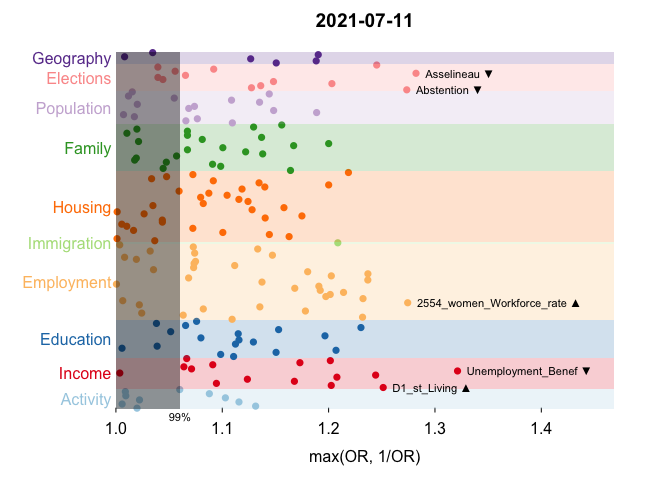<!-- -->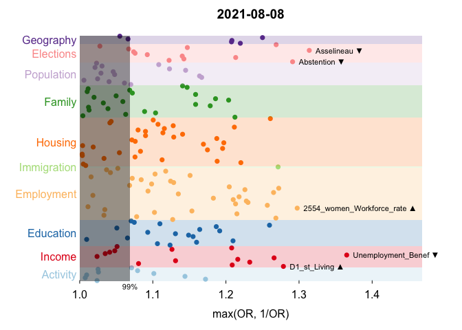<!-- -->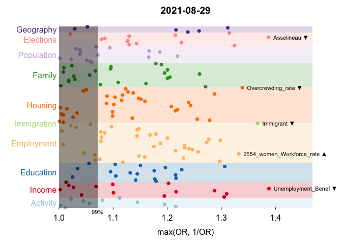<!-- -->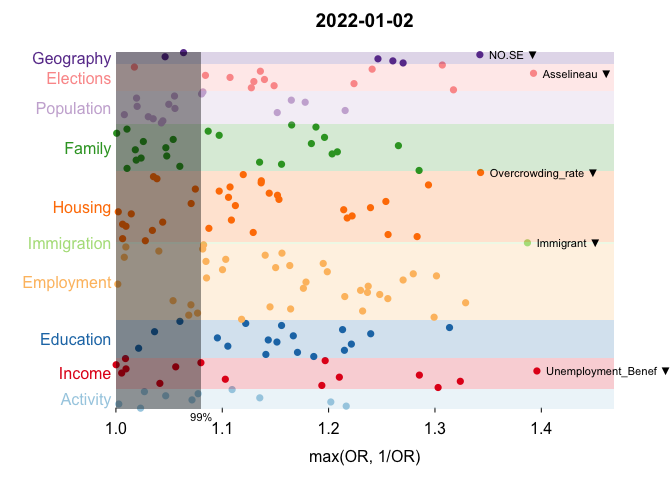<!-- -->

## By deciles, quantitatively, adjusting ages


```r
if(runComputations){
  # Define the combinations of parameters to be tested
  parmsDec <- expand.grid(varPred = names(dat.nocorr)[-1], 
                          thedate = c(date1, date2, date3, date4), 
                          predTransform = "discretize", 
                          vaccAge = "by_age", 
                          by.prbs = 0.1, 
                          permutation = FALSE,
                          stringsAsFactors = FALSE)
  
  # Permutation
  # Base combination of parameters
  tmpparmsPerm <- expand.grid(varPred = "French_nlty", 
                              thedate = c(date1, date2, date3, date4), 
                              predTransform = "discretize", 
                              vaccAge = "by_age", 
                              by.prbs = 0.1, 
                              permutation = TRUE,
                              stringsAsFactors = FALSE)
  # Add repeated parameters
  for(i in 1:nrep){
    parmsDec <- rbind(parmsDec, tmpparmsPerm)
  }
  rm(tmpparmsPerm)
  
  
  newd <- expand.grid(age.f = as.factor(ages), pred.std = 1:10)
  
  
  cat(nrow(parmsDec), " combinations to be tested\n")
  
  
  out <- as.data.frame(matrix(NA, ncol = 4, nrow = nrow(parmsDec)))
  
  # Compute OR for each combination of parameters
  for(i in 1:nrow(parmsDec)){
    if(i %% 10 == 0) cat(i, "") # Print counter
    # Compute the logistic regression on this combination of parameters
    mdl <- do.call(getLogReg, parmsDec[i, ])
    # Predicted values
    predsC <- adjustedPredict(mdl, newd, includeChildren = TRUE)
    predsA <- adjustedPredict(mdl, newd, includeChildren = FALSE)
    
    # Compute odds ratios
    ORC <- getORfromPredict(c(predsC[predsC$pred.std == 10, "adjustedRate"], predsC[predsC$pred.std == 1, "adjustedRate"]))
    ORA <- getORfromPredict(c(predsA[predsA$pred.std == 10, "adjustedRate"], predsA[predsA$pred.std == 1, "adjustedRate"]))
    
    out[i, ] <- c(ORC, ORA, max(ORC, 1/ORC), max(ORA, 1/ORA))
  }
  names(out) <- c("OR.withChildren", "OR.adults", "OR.abs.withChildren", "OR.abs.adults")
  dim(out)
  # Add the parameters
  outDec <- cbind(parmsDec, out)
  # Add type of predictor information
  outDec$typePred <- dicPred[outDec$varPred]
  # Full names
  outDec$typePredFull <- dic.fullpred[outDec$typePred]
  
  save(outDec, file = "outDec.RData")
  
}
```


```r
load("outDec.RData")

suffix <- ".withChildren"

xx <- outDec
xx$OR <- outDec[, paste0("OR", suffix)]
xx$OR.abs <- outDec[, paste0("OR.abs", suffix)]
xx$OR.abs.CI.max <- outDec[, paste0("OR.abs", suffix)]

plotManhattan(xx, ntop = 5)
```

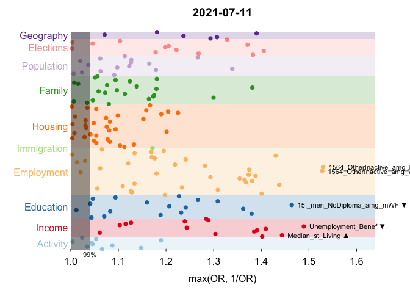<!-- -->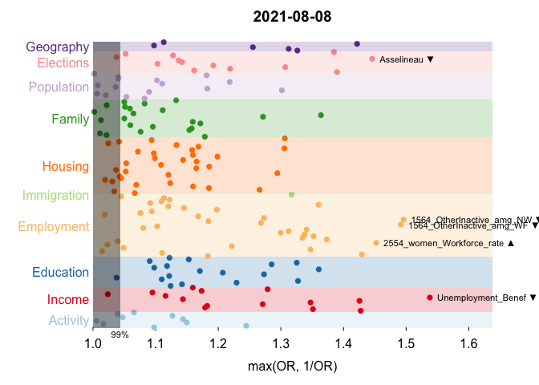<!-- -->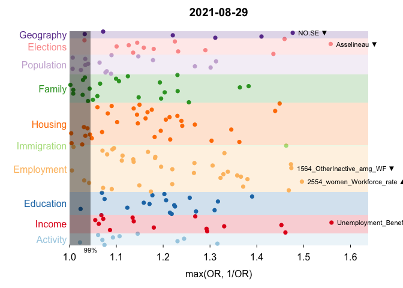<!-- -->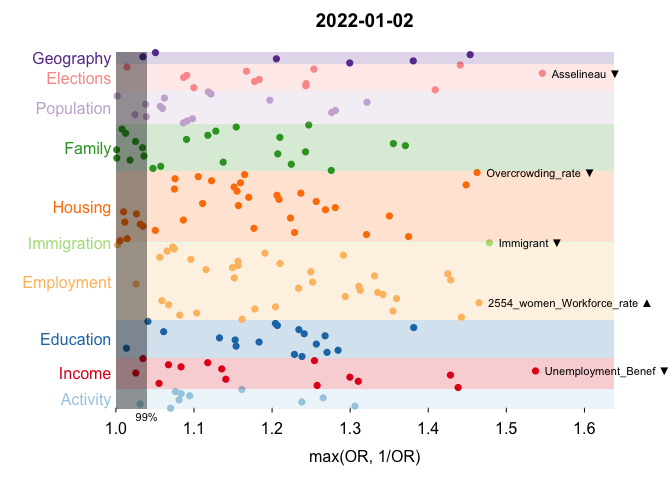<!-- -->


```r
suffix <- ".adults"

xx <- outDec
xx$OR <- outDec[, paste0("OR", suffix)]
xx$OR.abs <- outDec[, paste0("OR.abs", suffix)]
xx$OR.abs.CI.max <- outDec[, paste0("OR.abs", suffix)]

plotManhattan(xx, ntop = 5)
```

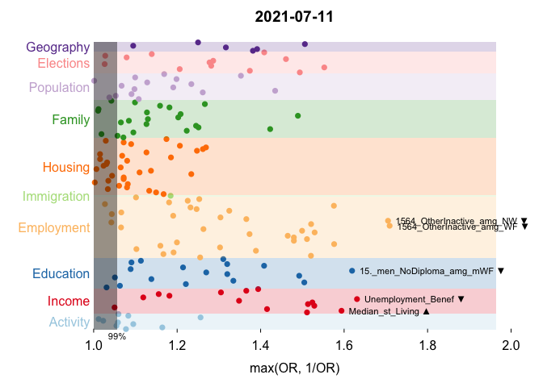<!-- -->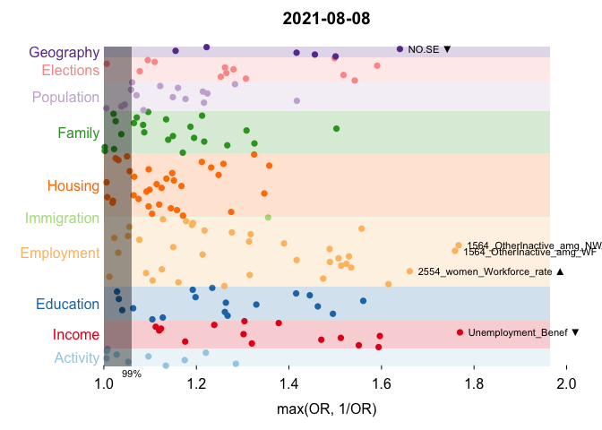<!-- -->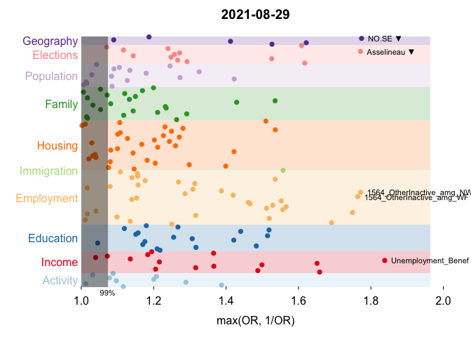<!-- -->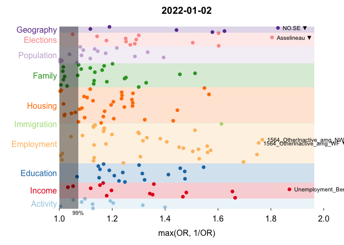<!-- -->

## Over time


```r
if(runComputations){
  dates <- sort(unique(vacc$date))
  minDate <- "2021-05-01"
  dates <- dates[dates >= minDate]
  
  # Define the combinations of parameters to be tested
  parmsTime <- expand.grid(varPred = c("Unemployment_Benef", "Immigrant", "Asselineau"), 
                           thedate = dates, 
                           predTransform = "discretize_factor", 
                           vaccAge = "by_age", 
                           by.prbs = 0.1, 
                           permutation = FALSE,
                           stringsAsFactors = FALSE)
  
  dim(parmsTime)
  
  newd <- expand.grid(age.f = as.factor(ages), pred.std = as.factor(1:10))
  
  
  # Initialize output
  outC <- outA <- as.data.frame(matrix(NA, ncol = 10, nrow = nrow(parmsTime)))
  
  # Compute OR for each combination of parameters
  for(i in 1:nrow(parmsTime)){
    if(i %% 10 == 0) cat(i, "") # Print counter
    # Compute the logistic regression on this combination of parameters
    mdl <- do.call(getLogReg, parmsTime[i, ])
    # Predicted values
    predsC <- adjustedPredict(mdl, newd, includeChildren = TRUE)
    predsA <- adjustedPredict(mdl, newd, includeChildren = FALSE)
    
    # Save
    outC[i, ] <- predsC$adjustedRate
    outA[i, ] <- predsA$adjustedRate
    
  }
  
  outC <- cbind(parmsTime, outC)
  outA <- cbind(parmsTime, outA)
  
  save(outC, outA, dates, file = "outTime.RData")

}
```


```r
load("outTime.RData")

plotPropTime(outC)
```

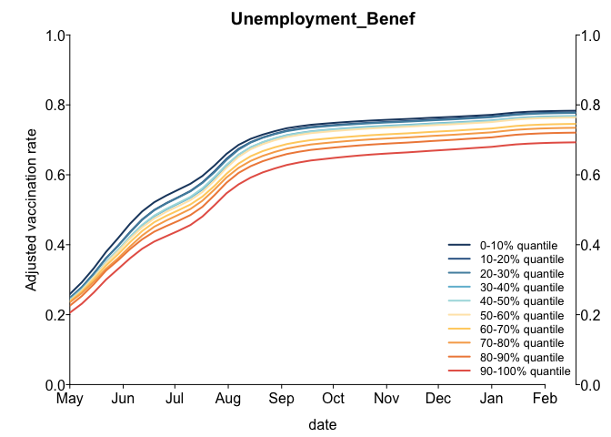<!-- --><!-- --><!-- -->


```r
plotPropTime(outA)
```

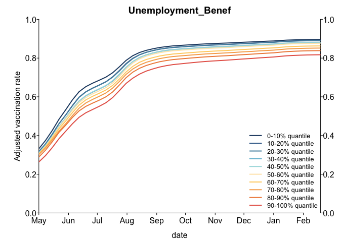<!-- -->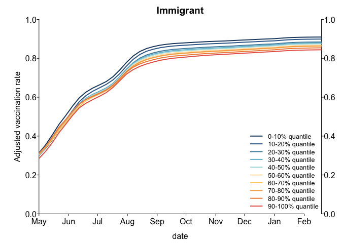<!-- -->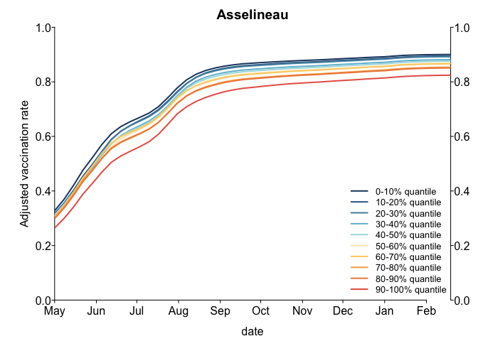<!-- -->

# Geographic


```r
library(mapsf)
```

```
## Loading required package: sf
```

```
## Linking to GEOS 3.9.1, GDAL 3.3.1, PROJ 8.1.0
```

```r
# Geographic information for maps
load("../data/mapFiles_withDepReg.RData")
load("../data/chefslieux.RData")
```


```r
#varPred <- "X1564_OtherInactive_amg_NW"

source("2_plot-map.R")
plotMapVar("Unemployment_Benef", byp = 0.1)
```

<!-- -->


```r
plotMapVar("Unemployment_Benef", byp = 0.5)
```

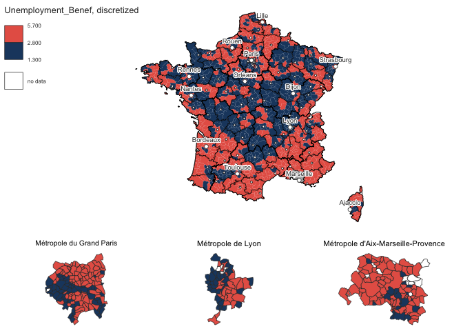<!-- -->

```r
plotMapVar("Unemployment_Benef", byp = 0.1)
```

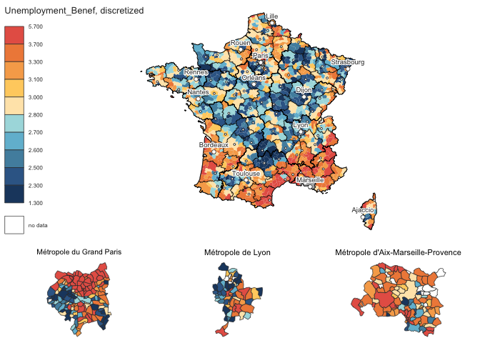<!-- -->

```r
#vv <- dat.all[, "Unemployment_Benef"]
#plot(discretizeQ(vv, seq(0, 1, 0.1)), 
#     discretizeQ(vv, seq(0, 1, 0.5)))

plotMapVar("Asselineau", byp = 0.1)
```

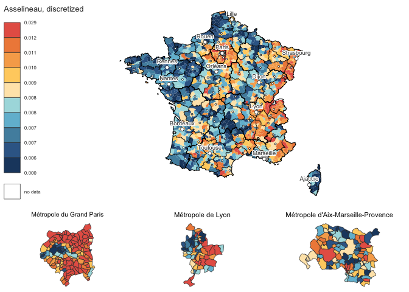<!-- -->

```r
plotMapVar("Abstention", byp = 0.1)
```

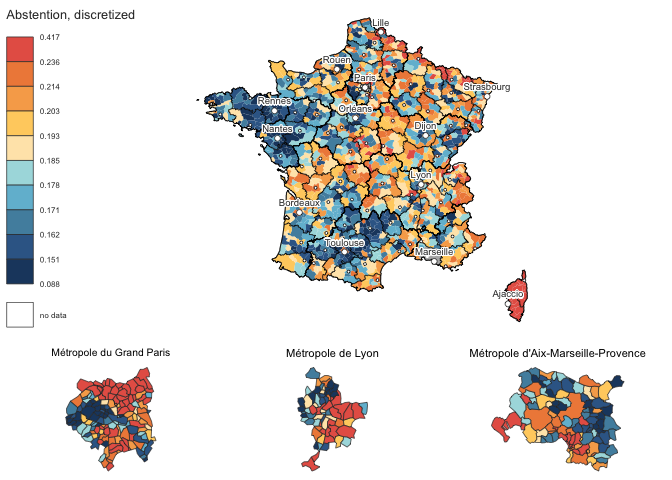<!-- -->

```r
plotMapVar("Immigrant", byp = 0.1)
```

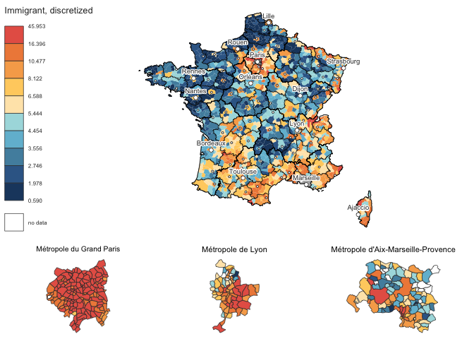<!-- -->

```r
plotMapVar("X1564_OtherInactive_amg_NW", byp = 0.1)
```

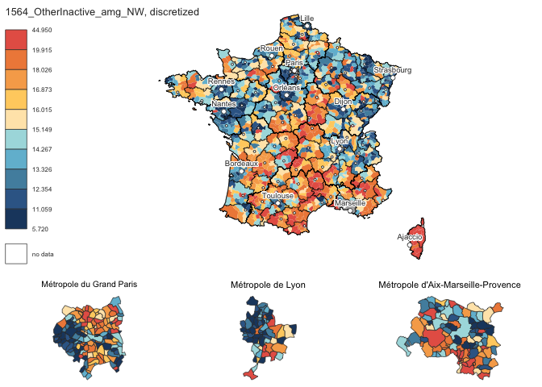<!-- -->

# Essais


```r
v <- dat.all[, c("codgeo", "French_nlty")]
vx <- v[which(is.na(v$French_nlty)), ]
vx
v[1, ]
head(v)
tail(v)

library(inseeLocalData)
?inseeLocalData

#install.packages("insee")
library(insee)

get_dataset_list()

https://api.insee.fr/donnees-locales/V0.1/donnees/geo-POP@GEO2021RP2018/EPCI-247100647.INATC
```


```r
?prcomp

# Predictors
# New dataset with the predictors
dat2 <- dat.nocorr[, -1]

# For each predictor
for(col in colnames(dat2)){
  # Get the subset of the data
  v <- dat2[, col]
  # Compute the mean value, excluding NAs
  mv <- mean(v, na.rm = TRUE)
  # Fill in NAs with the mean
  v[is.na(v)] <- mv
  # Put back in the table
  dat2[, col] <- v
}

pca <- prcomp(dat2, center = TRUE, scale = TRUE)
ggbiplot(pca)

head(pca)

library(devtools)
install_github("vqv/ggbiplot")
library(ggbiplot)

plot(pca$x[, c("PC1", "PC2")])

pcax <- as.data.frame(pca$x)
pcax$codgeo <- dat.nocorr$codgeo

thedate <- date3
sub <- vacc[which(vacc$date == thedate & vacc$classe_age != "TOUT_AGE"), ]
subb <- adultVacc(sub)

sub3 <- merge(subb, pcax, all = TRUE, by = "codgeo")
sub3$typeTaux <- discretizeQ(sub3$taux_cumu, prbs = seq(0, 1, by = 0.1))
palCat <- rev(met.brewer("Hiroshige", n = 10, type = "continuous"))
names(palCat) <- 1:10

plot(sub3$PC1, sub3$PC2, col = palCat[sub3$typeTaux], pch = 16)

str(pca)
head(sub3)
dim(subb)
dim(pcax)  

sort(pca$rotation[, "PC1"], decreasing = TRUE)[1:30]
sort(pca$rotation[, "PC2"], decreasing = TRUE)[1:30]

head(pca)
summary(pca)

pca$sdev / sum(pca$sdev)
str(pca)

length(pca$rotation[, "PC2"])
length(subb$taux_cumu)

plot(sub3$PC2, sub3$taux_cumu)

out <- matrix(NA, nrow = (ncol(pcax) - 1), ncol = 4)
for(i in 1:(ncol(pcax) - 1)){
  mdl <- cor.test(sub3[, paste0("PC", i)], sub3$taux_cumu)
  out[i, ] <- c(mdl$estimate, mdl$conf.int, mdl$p.value)
}
out <- as.data.frame(out)
names(out) <- c("estimate", "ci1", "ci2", "pval")
out$PC <- seq_len(nrow(out))

out[order(abs(out$estimate), decreasing = TRUE), ][1:5, ]
ii <- out[order(abs(out$estimate), decreasing = TRUE), ][1:5, "PC"]

# Composition of the PCs
for(i in ii){
  print(i)
  print(t(sort(pca$rotation[, paste0("PC", i)], decreasing = TRUE)[1:20])) 
}
sort(pca$rotation[, "PC2"], decreasing = TRUE)[1:30]

plot(sort(abs(out$estimate)))

range(out$estimate)

head(out)
mdl2 <- cor.test(sub3$PC2, sub3$taux_cumu)
mdl2

mdl1 <- cor.test(sub3$PC1, sub3$taux_cumu)
mdl1
str(mdl1)
summary(mdl1)
mdl3 <- cor.test(sub3$PC3, sub3$taux_cumu)
mdl3

summary(mdl)

library(nlme)
?gls
         gls(divspe ~ loggrad_urb+grad_agrimean, method = "ML", 
corr=corExp(c(300000,0.7), form=~x_lambert93+y_lambert93, nugget=T), 
na.action = na.omit, data = df)
```

