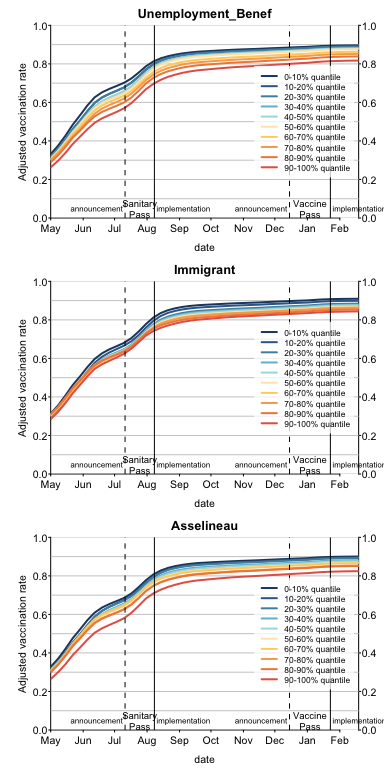

The French domestic Pass Sanitaire did not solve vaccination inequities: a nationwide longitudinal study on 64.5 million individuals

# Abstract

Context: Implemented during the Summer 2021, the French "Sanitary Pass" led to an increase in vaccination rates in France, but spatial heterogeneities in vaccination rates are still striking [LG1]. It morphed into a "Vaccine Pass" in early 2022. To identify potential determinants of these heterogeneities and evaluate the French Sanitary and Vaccine Pass' efficacies in reducing them, we used a data-driven approach on exhaustive nationwide data, gathering 141 socio-economic, political and geographic indicators.

Methods: We considered the association between being a district above the median value of the first-dose vaccination rates and being above the median value of each indicator at different time points: just before the sanitary pass announcement (week 2021-W27), just before the sanitary pass came into force (week 2021-W31) and one month after (week 2021-W35), and the equivalent dates for the vaccine pass (weeks 2021-W49, 2022-W03, 2022-W07). We then considered the change over time of vaccination rates according to the XX most associated indicators, by deciles. 

Results: The indicators most associated with vaccination rates were the share of local income coming from unemployment benefits, the proportion of immigrants in the district, and vote for a fringe candidate at the 2017 Presidential election (XXX revoir description Asselineau). Vaccination rate also follow a marked North-West -- South East gradient, with lower vaccination coverage in the South-East of France. 

Conclusion: Our analysis reveals that, both before and after the introduction of the French sanitary pass, factors with the largest impact are related to poverty, immigration, and trust in the government XXX Check if you agree. 

# Introduction

The rapid development of effective COVID-19 vaccines brought the hope of a rapid return to normalcy, but heterogeneous vaccination rates, both among countries because of inequitable distributions of doses [@usherBeautifulIdeaHow2021] and within countries [@caspiSocioeconomicDisparitiesCOVID192021; @murthyDisparitiesCOVID19Vaccination2021], jeopardize epidemic control.
 
Hesitancy and hostility toward vaccination have been comparatively high in France in recent decades [@europeancommission.directorategeneralforhealthandfoodsafety.StateVaccineConfidence2018]. Modern vaccine hesitancy in France started with claims of a link between the hepatitis B vaccine and multiple sclerosis [@wardVaccineHesitancyCoercion2019]; it strongly increased following the 2009-2010 vaccination campaign against pandemic flu, the contested management of which in France was a tipping point that led to higher vaccine hesitancy and hostility [@guimierResistancesFrancaisesAux2021; @wardVaccineHesitancyCoercion2019]. 
The trend was confirmed with the COVID-19 pandemic [@lindholtPublicAcceptanceCOVID192021;  @spireSocialInequalitiesHostility2021]: just before Covid-19 vaccines became available, intentions to get vaccinated were comparatively very low in France compared to other countries (44% of the respondents in [@woutersChallengesEnsuringGlobal2021] in the Fall 2020; about 40% of respondent in [@santepubliquefranceCoviPrevEnquetePour2021] in December 2020). Acceptance of the COVID-19 vaccine however gradually grew during 2021 [@santepubliquefranceCoviPrevEnquetePour2021; @wardPremiersResultatsEnquete2021].

Spatial heterogeneties in vaccination rates have already been documented in France for previous vaccines. Vaccination coverage for the Hepatitis B vaccine and for the Measles-Mumps-Rubella vaccine has been lower in the South of France, and especially in the South-East of the country [@guimierResistancesFrancaisesAux2021]. Distance to the central political power in Paris, as well as a sense of belonging to a local community with a strong cultural identity, have been put forward as potential explanations for this geographic gradient in vaccination rates [@guimierResistancesFrancaisesAux2021]. 

Attitudes toward vaccination are also known to be influenced by social and territorial inequalities. Surveys conducted in 2020 in France showed that respondents with lower education [@schwarzingerCOVID19VaccineHesitancy2021; @coulaudCOVID19VaccineIntention2022], lower income levels or less trust in authorities [@spireSocialInequalitiesHostility2021; @lindholtPublicAcceptanceCOVID192021] were more likely to be hostile to COVID-19 vaccines. <!-- A survey conducted in July 2021 in France [@bajosWhenMistrustGovernment2022] on close to 81000 participants indicated that unvaccinated respondents were more likely to have lower income and more likely to belong to racialised minorities than vaccinated ones. The survey also confirmed that mistrust in the government was fueling refusal to be vaccinated [@bajosWhenMistrustGovernment2022]. -->

<!-- XX MOVE INTERNATIONAL COMPARISONS IN THE DISCUSSION Whether differential intentions translated into effective differences in vaccination, as described in other countries [Caspi21, Murthy21], remained to be shown in France.  -->
 
By mid-July 2021, France was facing an epidemic wave due to the Delta variant. To speed up vaccination, President Macron announced on 12 July 2021 the implementation of a domestic "sanitary pass" (le passe sanitaire), which came fully into force on 9 August 2021. Presenting as a QR code, a long-term sanitary pass was obtained after full vaccination (two doses, or only one dose in the case of a documented previous Covid-19 infection), and a short-term version could be obtained with a negative Covid-19 test.
The "sanitary pass" was required in most cultural venues, for both indoor and outdoor dining and in health structures. This announcement led to an unprecedented demand for vaccination [@oliu-bartonEffectCOVIDCertificates2022], which was considered internationally as a potential model to follow. Vaccination rates climbed from about 64% of the population over 20 years old by 11 July 2021 (52% of all ages) to 82 on 5 September 2021 (69% of all ages). Because it targeted pay-for social activities, however, the "sanitary pass" was feared to have a limited impact on vaccination inequities. By mid-December 2021, at the height of the winter Delta wave, and while the Omicron wave was looming, the French Prime Minister announced that the Sanitary Pass would become a Vaccine Pass, i.e. that a negative Covid-19 test would not provide a temporary QR code any longer for adults -- making vaccination implicitly mandatory in France. The Vaccine Pass came into force on 24 January 2022. 

This study aims to obtain further insights on the socio-economic, political and geographic factor associated with vaccination rates, and to evaluate the effect of the French domestic sanitary pass, by using nation-wide, exhaustive datasets.
 
# Methods

## Data 

<!-- Vaccination -->
The French state health insurance service (Assurance Maladie) provides public datasets of vaccination rates in France. These datasets are based on aggregated individual data on beneficiaries of the national health insurance service who received health care in the past year. These exhaustive datasets are updated weekly, and are provided at the district scale nationally (EPCI: *Établissement public de coopération intercommunale*, an administrative level gathering multiple towns or cities) and at the suburban scale for the Paris, Lyon, and Marseille metropolitan areas. For this study, we focused on mainland France, because vaccination rates are much lower in oversea localities, and because determinants of vaccination rates are likely to differ in oversea localities compared to mainland ones. Our dataset included 1555 districts (1228 EPCIs and 327 districts at the suburban scale in Paris, Lyon, Marseille). 

The vaccination dataset for mainland France encompasses about 64.5 million individuals (median district size 22310 inhabitants, interquartile range 11012--43038). The vaccination data are available by age class: 00--19, 20--39, 40--54, 55--64, 65--74, 75 and over. Population sizes for each locality and each age class are also provided. <!-- These population sizes are updated monthly to account for individuals aging, potential residential moves, and deaths. XXX TODO: Demander pourquoi les tailles de pop sont constantes au cours du temps FD: Removed because was not specified -->

<!-- Other data -->

We paired these vaccination data with three other datasets gathering socio-economic, political orientation and geographic variables.

Socio-economic data are provided by the French national statistics institute (INSEE), and are available at the same administrative levels as the vaccination data. We selected the most recent dataset available (year 2018). The different variables available in the dataset are classified by INSEE according to 8 categories (Activity, Education, Employment, Family, Housing, Immigration, Income, Population).  
Latitude, longitude and surface data were extracted from open geographic datasets. We calculated from them four additional geographic indicators: distance to Paris, relative position along a South-East--North-West gradient, relative position along a South-West--North-East gradient, and local population density.  
Political orientation data consisted of the results of the 2017 Presidential election in France, which we aggregated to reconstitute the same administrative levels as the vaccination dataset. This political dataset contains the proportions of votes for each of the 11 candidates of the first round, 2 candidates of the second round (Macron and Le Pen), and proportion of abstention at each round. 

These three datasets comprised 312 indicators. We then removed those indicators with over 5% missing data, or with over 0.9 correlation with other indicators of the dataset, which left us with 141 indicators: 123 socio-economic indicators (Activity: n = 10; Education: n = 16; Employment: n = 25; Family: n = 20; Housing: n = 30; Immigration: n = 1; Income: n = 13; Population: n = 8); 6 geographic indicators; 12 political indicators. 

## Analysis

Vaccination was accessible to all adults in France after 27 May 2021. It opened to teenagers (12-17 year olds) on 15 June 2021, and to children (5-11 year olds) on 22 December 2021. Because of this differential accessibility of vaccines, and because vaccine passport rules also differed for non-adults, we excluded the 00-19 age class from our analysis, and focused on vaccination rates among 20+ year-old individuals (hereafter "adults"). 

For each indicator in our dataset, at each of the four chosen dates (weeks 2021-W27, 2021-W31, 2021-W35, 2021-W49, 2022-W03, 2022-W07), we considered the association between living in a district above the median of a that indicator and individual first-dose vaccination rates among adults. Odds ratios (OR) were computed from the output of a logistic regression. To be able to compare predictors irrespective of the direction of the effect, we considered the maximum of `OR, 1/OR` (hereafter $\overline{OR}$). Note that vaccination data are at the individual level, and indicator data at the district level. The analysis is done at the individual level, with indicators characterizing the geographic districts in which individuals live.  
For each date, we determined a significance threshold by computing odds ratios on 1000 random permutations of a predictor, and identifying the value of the 99% percentile odd ratios ($\overline{OR}$) of these permuted data. 

For representative indicators among the most statistically significantly associated ones, we estimated standardized vaccination rates among adults over time, for each decile of each indicator (treated as a factor). These estimations were obtained from a logistic model taking age class into account; adult vaccination rates were standarsized using an age distribution matching that of mainland France. 

All analysis code is available at XXX; analyses were done in R version 4.0.4 (2021-02-15). 

<!-- 

- **27 mai 2021 (S21)** : toutes les personnes majeures peuvent prendre rendez-vous pour se faire vacciner en centre de vaccination pour des injections avec les vaccins Pfizer-BioNTech ou Moderna à compter du 31 mai 2021.
- **15 juin 2021 (S24)** : les 12 à 17 ans inclus ans peuvent se faire vacciner avec le vaccin Pfizer-BioNTech en centre de vaccination. Le 24 juillet 2021, l'Agence européenne du médicament (EMA) a délivré une autorisation du vaccin Moderna sur lequel la HAS a rendu un avis favorable le 28 juillet.
- **12 juillet 2021 (S28)** : annonce du président le la république concernant la mise en place du pass sanitaire.
- **9 août 2021 (S32)** : mise en place de l'obligation du passe sanitaire dans les lieux concernés.
- **1er septembre 2021 (S35)** : une campagne de rappel est mise en place pour stimuler le système immunitaire des plus vulnérables : les résidents d'EHPAD et d'USLD, les personnes de 65 ans et plus vivant à domicile, les personnes souffrant de comorbidité(s), les personnes atteintes de pathologies à haut risque de forme grave, les personnes ayant été vaccinées avec le vaccin Janssen.
- **15 septembre 2021 (S37)** : l'obligation vaccinale concernerait tous les personnels des établissements de santé, établissements d'hébergement pour personnes âgées dépendantes (Ehpad) et établissements pour personnes en situation de handicap et tous les professionnels ou les bénévoles en contact avec des personnes âgées ou vulnérables, y compris à domicile. Cette mesure a fait l'objet d'un projet de loi relatif à la gestion de la crise sanitaire examiné par le Parlement depuis le 20 juillet 2021.

-->

# Results

We investigated the associations between each of the 141 indicators characterizing districts of residence, and the fact of having received at least one Covid-19 vaccine dose, on the whole population of mainland France. Two indicators were among the top five most associated one at all time points (see Figure \@ref(fig:figManhattan)): the share of local income coming from unemployment benefits (`Unemployment_Benef`; strongest association on 2022-01-23, $OR = 0.716$) 
and vote for the "anti-establishment" political party represented by the candidate Asselineau (`Asselineau`; $OR = 0.712$ on 2022-02-20). 
The three other most associated indicators did not change in the later dates that we considered, and were the proportion of immigrants in the district (`Immigrant`; $OR = 0.713$ on 2022-02-20), 
the district's relative position along a North-West--South-East gradient (`NO-SE`; $OR = 0.745$ on 2021-12-12) 
and the proportion of overcrowded households (`Overcrowding_rate`; $OR = 0.738$ on 2022-01-23). 

<!-- [moved to Discussion]
The share of local income coming from unemployment benefits (`Unemployment_Benef`) and the proportion of overcrowded households (`Overcrowding_rate`) are two indicators linked to poverty. Votes for Mr Asselineau (`Asselineau`) represented a minority of cast votes in 2017 in France (less than $1\%$ overall). This candidate for instance proposed that France exits the European Union, leave the Euro zone and reinstall the Franc currency; he was a proponent of hydroxychloroquin and ivermectin during the Covid-19 pandemic, and publicly expressed doubts about the safety of available Covid-19 vaccines. 
-->

(\#fig:figManhattan)Manhattan plots of the Odds ratios for each of the indicator of our dataset, by date. Left column: around the Sanitary Pass implementation; right column: around the Vaccine Pass implementation. The top odds ratios are labelled at each time point; the arrow next to the name indicates the direction of the effect. The gray rectangle corresponds to the 99% percentile of odds ratios in the permuted data; points falling in the rectangle are considered as non-significant.

Our odds ratio calculations were based on a crude version of each indicator, which were dichotomized into values above or below the median of each indicator. To better visualize the effects (or lack thereof) of the sanitary and vaccine passes on vaccination rates over time, we computed age-adjusted vaccination rates over time, by decile of three of the most associated indicators, treated as factors (see Figure \@ref(fig:figOverTime)). While the Sanitary Pass led to an overall increase in vaccination rates, the Vaccine Pass did not affect the trend of change in vaccination rates. Heterogeneities in vaccination rates persisted after both types of pass; vaccination rates appear neatly ordered by decile of each indicator. 

(\#fig:figOverTime)Age-adjusted vaccination rates among adults, over time, by decile of each indicator (presented by a color gradient). The dates of announcements and implementations of the sanitary and vaccine pass are indicated near the horizontal axes.

Finally, historically under-vaccinated areas in France stand out as being less vaccinated against Covid-19, in particular the South-East region (see Figure \@ref(fig:figMap)).  

(\#fig:figMap)Adult vaccination rates by district

# Discussion

Our results, based on exhaustive national datasets, indicate that the French sanitary pass, and the later vaccine pass, did not solve Covid-19 vaccination heterogeneities, but instead crystallized them. Indicators most associated with vaccination rates were associated to poverty, immigration, and anti-establishment vote (or abstention). For instance, the odds for an adult to still be unvaccinated by the end of February 2021 are about 1.4 times higher when living in the districts with higher than median value share of income coming from unemployment benefits, and when living in the districts with lower than median value. 

The indicators associated to vaccination rates can be interpreted in the light of the dimensions of vaccine hesitancy [@wardFrenchHealthPass2022].  
A first reason for vaccine hesitancy is complacency: not fully perceiving the benefit of vaccination or the risks of severe disease. While in this case a sanitary or vaccine pass may convince complacent individuals to get vaccinated, it is less efficient if the associated constrain is low. As the French domestic pass was associated to pay-for activities (restaurants, tourism), its persuading effect could be limited among poorer populations, which may explain the association of lower vaccination rate with poverty in the data that we analyzed.  
A second reason for vaccine hesitancy is confidence, i.e. trust in the vaccine, in the health care system, and more generally in the government [@wardFrenchHealthPass2022; @lindholtPublicAcceptanceCOVID192021]. A survey conducted in July 2021 in France confirmed that trust in the government and trust in scientists were associated to higher odds to be vaccinated [@bajosWhenMistrustGovernment2022]. Votes for Mr Asselineau can be interpreted as mistrust in the government (or more generally, against the establishment), and the association with lower vaccination rates can be interpreted as a lack of confidence. Among political indicators, the second strongest association is with abstention rates (higher abstention rates being associated to lower vaccination rates), again signaling higher distrust for institutions [@wardFrenchPublicAttitudes2020]. Likewise, the lower vaccinations rates in the South-East of France can be interpreted as mistrust of the central government in Paris.   
Finally, a third reason for vaccine hesitancy is convenience, that is availability and accessibility of the vaccines [@wardFrenchHealthPass2022]. During the first half of 2021, vaccination rate in France was mostly constrained by dose availability. Vaccination slots were to be booked online, and there was no general system for sending individual invitations to get vaccinated. These accessibility issues may explain the association we find between lower vaccination rates and living in a district with a high proportion of immigrants, which may for instance reveal language barriers. 

Although presented in our study independently, the different indicators are linked, and their combinations affect vaccination rates. For instance, the effect of mistrust in the government on vaccination refusal was shown to be even stronger in poorer individuals than in richer points in a survey conducted in July 2021 in France [@bajosWhenMistrustGovernment2022]. 

Relative position of the district of residency along a North-West--South-East gradient is also associated with vaccination probability, the South-East being less vaccinated. This geographic feature, already documented for other kinds of vaccination [@guimierResistancesFrancaisesAux2021], have been shown to be the consequence of multiple determinants with a common consequence: a local climate of mistrust for the central Parisian power. Politically, anti-system votes (from the right as well as from the left) are traditionally concentrated in the South-East of France. Medically, General Practitioners (GPs) based in the South-East, and to a lesser extent those in the South-West, have been shown to tend to have a more negative opinion of vaccination than their colleagues practicing in the northern part of France [@Gautier2013a]. This greater skepticism influences GP practices and attitudes, resulting in a lesser degree of compliance with vaccination schedules than GPs in the northern half of France [@Collange2015]. Physical distance to the central government and institutions, based in Paris, coupled with a sense of belonging to a local community with a strong cultural identity, as is the case for example in the Marseille metropolis or in the Cévennes, play a role in indifference or mistrust towards institutions perceived as distant authorities [@guimierResistancesFrancaisesAux2021]. Finally, in and around the Marseille metropolis, the image of a rebellious territory was reinforced since the first months of the epidemic in France through the hypermediatized Pr Didier Raoult. Based in Marseille, he was a promoter of a controversial treatment against Covid-19 based on hydroxychloroquine and azithromycin, and later held ambiguous positions regarding Covid-19 vaccination. He has become a local icon, thanks to his anti-system positions, and against the hostility of most of the medical world towards his work. All in all, around the city of Marseille, and more broadly in South-Eastern France, the climate of suspicion against Parisian institutions, which had long been rooted in the area, hardened during the Covid-19 crisis, and was associated with distrust of Covid-19 vaccines.   

<!-- Limitations -->
In this study, we used a data-driven approach, i.e. we did not focus on indicators that we *a priori* thought to be associated with vaccination rate. While our vaccination data are at the individual level, the socio-economic, political and geographic indicators are at the district level, and must therefore be interpreted as such (e.g., we cannot not show that receiving unemployment benefits is associated with lower vaccination probability, but we find an association with lower vaccination probability and the fact of living in a district where a large share of income comes from unemployment benefits). Our data cover mainland France, 64.5 million individuals, and are real-world data: we consider realized vaccination rates and not intentions to be vaccinated. In addition, since our data are based on record of the national health insurance service, vaccination rates do not come from self-reported, and there is in theory no reporting bias. 

Although we interpreted our results through the lens of a classification of reasons for vaccine hesitancy, our data only concern realized vaccination rates, and not the associated intentions. According to a survey conducted in the Fall 2021, the introduction of the sanitary pass led to an increase in the share of individuals reporting being "angry they had to be vaccinated" [@wardFrenchHealthPass2022]. Conversely, we cannot tell why individuals who are still not vaccinated in February 2022 are so -- e.g., whether it is hesitancy, refusal, or accessibility issues. Given the implementation of the vaccination campaign in France, namely the absence of individual invitations to get vaccinated, the reliance on private online booking systems, it is still possible that, in spite of some local outreach efforts, vaccine accessibility remains an issue, and may explain at least part of the association of lower vaccination rates with poverty. 

By emphasizing a differentiated use of COVID-19 vaccination according to a socio-economic gradient, our study confirms the strong impact of social inequalities on COVID-19. The most deprived areas have already been shown to have been disproportionately infected and hospitalized during the pandemic [@jannotLowincomeNeighbourhoodWas2021; @bajosWhenLockdownPolicies2021]. We show that poorer districts are also the least vaccinated and, hence, the most still at risk, despite the widely celebrated domestic sanitary pass. There is an urgent need to define new vaccination policies that truly address social inequities. 

AUTRES POINTS DE DISCUSSION POSSIBLES: distrust with promises of return to normal life (Summer 2021); changing conditions (inclusion of booster dose)

+ DEPOLITICIZE (Bajos/Ward)

